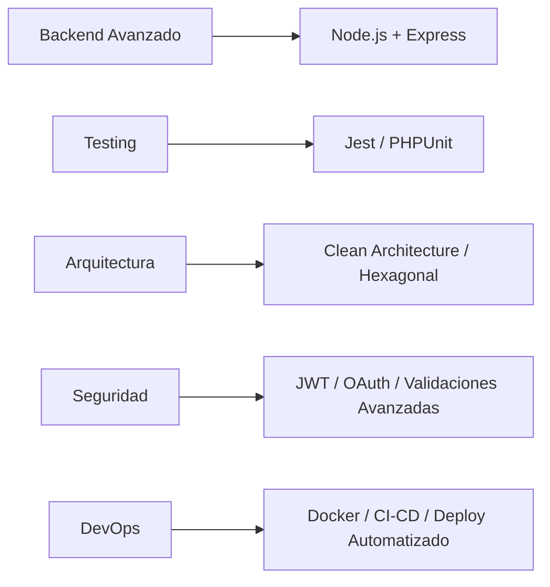

<div align="center">

# Brandon Eliel Pared

### Desarrollador Full Stack

**JavaScript • TypeScript • React • Next.js • Laravel • C# • SQL**

<br>

<table align="center">
<tr>
<td align="center" width="33%">

</td>
<td align="center" width="33%">
<a href="https://www.linkedin.com/in/brandonpared">

</a>
</td>
<td align="center" width="33%">
<a href="https://github.com/iElielP">

</a>
</td>
</tr>
</table>

</div>

---

## Sobre mí

Desarrollador Full Stack especializado en la construcción de aplicaciones web escalables y robustas, integrando frontend, backend y bases de datos. Mi enfoque está en la arquitectura de software, buenas prácticas de desarrollo, patrones de diseño y clean code.

Trabajo con tecnologías modernas del ecosistema JavaScript/TypeScript (React, Next.js), frameworks backend como Laravel y .NET, y gestión de bases de datos relacionales (MySQL, SQL Server, Oracle PL/SQL). Me especializo en diseño de APIs REST, validaciones, lógica de negocio, trazabilidad del desarrollo y escalabilidad de sistemas.

Destaco por mi pensamiento analítico, capacidad de resolución de problemas técnicos y adaptación a nuevas tecnologías. Busco continuar creciendo en entornos profesionales donde pueda aportar valor desde la ingeniería de software.

---

## Formación Académica

**Tecnicatura Universitaria en Programación** • *Universidad Tecnológica Nacional (UTN)* — En curso  
Formación integral en desarrollo de software, programación estructurada y orientada a objetos, bases de datos relacionales, arquitectura de sistemas web y herramientas modernas de desarrollo.

**Tecnicatura en Informática Personal y Profesional** • *EEST N°5* — Finalizado  
Base técnica sólida en informática, lógica de programación, diseño de sistemas y fundamentos de desarrollo de software.

---

## Stack Tecnológico

### Lenguajes


### Frontend


### Backend


### Bases de Datos


### Herramientas


---

## Competencias Técnicas

```typescript
const skills = {
  frontend: ["React", "Next.js", "TypeScript", "Responsive Design"],
  backend: ["Laravel", ".NET/WinForms", "API REST", "Validaciones", "Lógica de Negocio"],
  databases: ["MySQL", "SQL Server", "Oracle PL/SQL", "Diseño Relacional"],
  practices: ["Clean Code", "Modularización", "Patrones de Diseño", "Documentación Técnica"],
  architecture: ["MVC", "Integración Frontend-Backend", "Diseño de Endpoints"]
};
```

**Áreas de experiencia:**
- Desarrollo de aplicaciones web full stack con integración completa frontend-backend
- Diseño e implementación de APIs REST con validaciones y manejo de errores
- Modelado y gestión de bases de datos relacionales
- Implementación de lógica de negocio y reglas de validación
- Estructuración de proyectos bajo patrones profesionales
- Control de versiones y colaboración con Git/GitHub

---

## Roadmap de Aprendizaje

Tecnologías y conceptos en proceso de incorporación para fortalecer mi stack técnico:



**Objetivos técnicos:**
- Profundizar en Node.js como alternativa backend
- Implementar testing automatizado (unitario e integración)
- Aplicar arquitecturas limpias y escalables
- Fortalecer conocimientos en seguridad de APIs
- Dominar procesos de deployment y containerización

---

## Estadísticas de GitHub

<div align="center">


</div>

<br>

<div align="center">


</div>

---

## Contacto

<div align="center">

Estoy abierto a oportunidades profesionales, colaboraciones técnicas y proyectos desafiantes.

</div>

<br>

<table align="center">
<tr>
<td align="center" width="33%">
<a href="mailto:eliel.bep@gmail.com">

</a>
</td>
<td align="center" width="33%">
<a href="https://www.linkedin.com/in/brandonpared">

</a>
</td>
<td align="center" width="33%">
<a href="https://github.com/iElielP">

</a>
</td>
</tr>
</table>

---

<div align="center">

**"Código limpio, soluciones escalables, crecimiento constante."**

</div>
